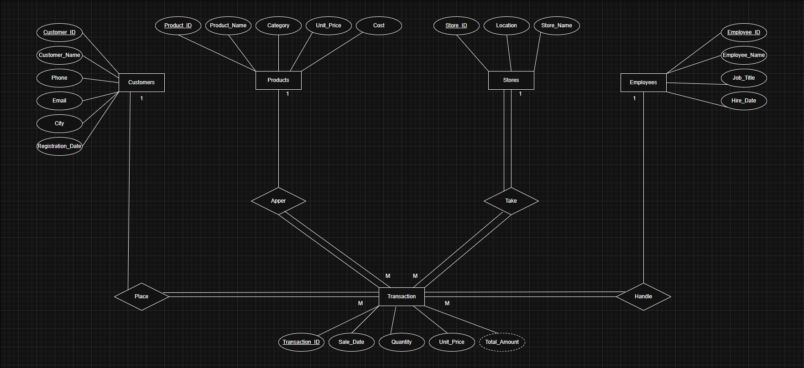
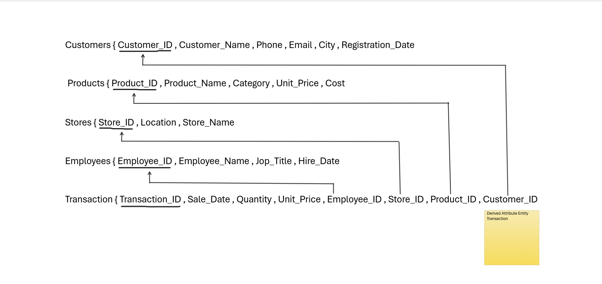
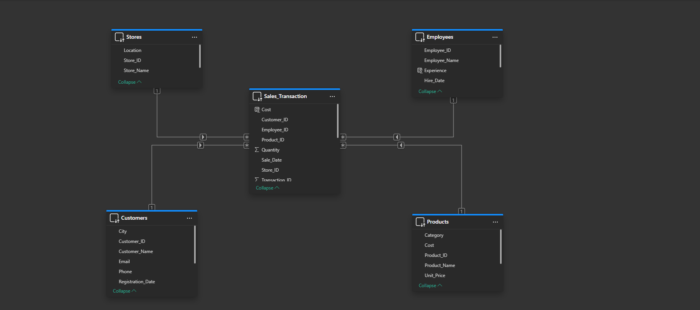
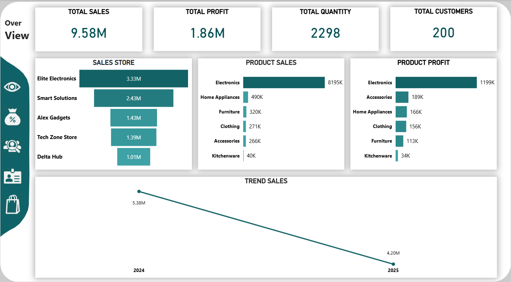
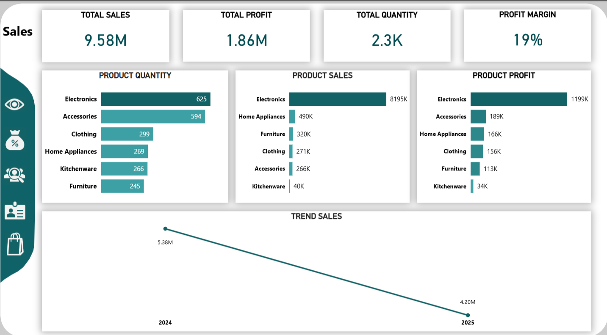
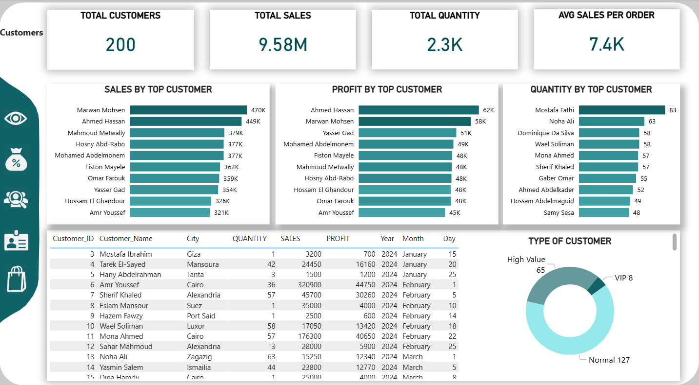
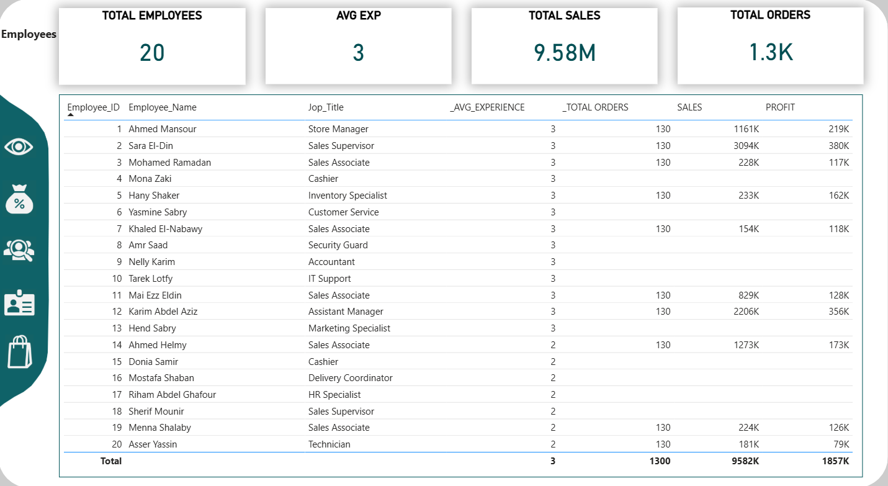
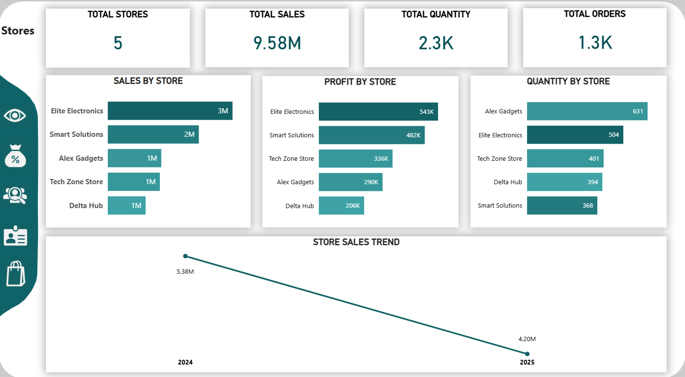

📊 Sales Management & Analytics System

🔍 Project Overview
This project is a **full end-to-end data analytics system** that covers the complete lifecycle  
from **business requirements → ERD → database tables → data modeling → Power BI dashboards**.

The system analyzes sales performance, customers, products, employees, and stores  
to support **data-driven decision making**.

---

🧠 Project Scope
The project includes:
- Database design using ERD
- Mapping ERD to relational database tables
- Data modeling (Fact & Dimension tables)
- Sales analytics using Power BI
- Interactive dashboards for different business views

---

🗂 Database Design

🔹 ERD Design
The ERD defines the main business entities:
- Customers
- Products
- Stores
- Employees
- Transactions (Fact Table)

Each entity was designed following normalization rules and business logic.

---

🔹 Tables Mapping
The ERD was transformed into relational database tables
with proper **Primary Keys** and **Foreign Keys** to ensure data integrity.

**Main Tables:**
- Customers
- Products
- Stores
- Employees
- Sales_Transaction (Fact Table)

---

🧩 Data Model (Power BI Relationships)
The data model follows a **Star Schema** design:

- **Fact Table:** Sales_Transaction  
- **Dimensions:** Customers, Products, Stores, Employees  

This structure enables efficient analysis and accurate filtering across dashboards.

---

📊 Dashboards & Analysis

🔹 Overview Dashboard
- Total Sales  
- Total Profit  
- Total Quantity  
- Total Customers  
- Sales Trend  

---

🔹 Sales Dashboard
- Sales by Product  
- Sales by Category  
- Profit Margin  
- Quantity Analysis  
- Year-over-Year Trends  

---

### 🔹 Customers Dashboard
- Top Customers  
- Sales & Profit per Customer  
- Customer Segmentation  
- Average Sales per Order  

---

🔹 Employees Dashboard
- Sales by Employee  
- Profit Contribution  
- Experience Analysis  
- Orders handled per employee  

---

🔹 Stores Dashboard
- Sales by Store  
- Profit by Store  
- Quantity by Store  
- Store Performance Trend  

---

⚡ Data Connection
The project was built using **DirectQuery mode**, allowing:
- Live connection to the database
- Automatic data refresh
- Real-time reporting without manual refresh

This setup reflects real-world BI environments.

---

📈 Key Insights
- Electronics category generates the highest sales and profit  
- A small segment of customers contributes a large portion of revenue  
- Experienced employees tend to generate higher profits  
- Store performance varies significantly and requires targeted strategies  

---

🛠 Tools & Technologies
- Power BI
- Power Query
- DAX
- SQL
- ERD Modeling Tools

---

## 📁 Project Structure
